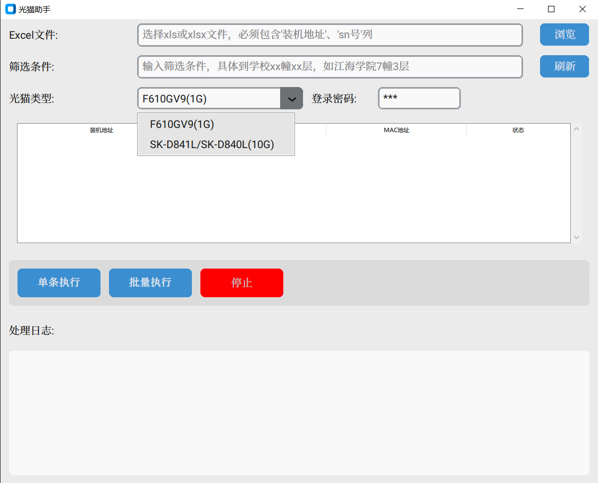

# OpticModem-Assistant

[](https://www.python.org/)
[](https://opensource.org/licenses/MIT)

一个基于Python的光猫SN码批量配置工具，支持自动化配置特定型号的光猫设备。

## 功能特点

- **批量SN配置**: 支持从Excel文件批量读取SN码并自动配置到光猫设备
- **设备检测**: 在配置前自动ping检测设备连通性
- **MAC地址验证**: 通过MAC地址检测确保设备更换后才会写入新的SN码
- **多设备支持**: 目前已配置1G(ZXHN F610GV9)和10G(SK-D841L)两种光猫型号
- **图形界面**: 基于Gooey框架的友好用户界面
- **断点续传**: 支持从上次中断的位置继续配置
- **进度追踪**: 实时显示配置进度和剩余时间
- **日志记录**: 自动记录配置状态到日志文件

## 截图

### 主界面



## 技术栈

- **Playwright**: 浏览器自动化，用于操作光猫Web界面
- **Gooey**: Python GUI框架，提供友好的用户界面
- **PyInstaller**: 打包工具，将程序打包为可执行文件
- **Pandas**: Excel文件处理和数据筛选
- **OpenPyXL**: 现代Excel格式文件处理
- **wxPython**: GUI后端框架

## 安装要求

- Python 3.9+
- Windows操作系统

## 安装步骤

1. 克隆仓库

```bash
git clone https://github.com/blacksamuraiiii/modem-assistant.git
cd modem-assistant
```

2. 安装依赖

```bash
pip install -r requirements.txt
```

3. 安装Playwright浏览器

```bash
playwright install chromium
```

## 使用方法

### 基本使用

1. 运行程序

```bash
python run.py
```

2. 在GUI界面中：
   - 选择包含SN码的Excel文件
   - 设置筛选条件（如装机地址）
   - 选择光猫类型（1G或10G）
   - 点击开始配置

### 测试脚本

```bash
# 测试1G光猫配置
python test_F610GV9_1g.py

# 测试10G光猫配置
python test__10g.py
```

### 打包为可执行文件

```bash
pyinstaller run.spec
```

## Excel文件格式

Excel文件应包含以下列：

- `装机地址`: 安装地址信息
- `sn号`: 要配置的SN码

示例：

| 装机地址           | sn号      |
| ------------------ | --------- |
| xx学院xx幢1层101室 | ABC123456 |

## 工作流程

1. **文件选择**: 用户选择Excel文件并设置筛选条件
2. **设备检测**: 程序ping检测光猫设备(192.168.1.1)连通性
3. **MAC验证**: 获取设备MAC地址，与上次配置记录对比
4. **自动登录**: 使用默认密码(***)登录光猫Web界面
5. **SN配置**: 导航到配置页面并输入SN码
6. **状态记录**: 记录配置状态到日志文件
7. **下一设备**: 等待设备更换后继续下一个配置

## 配置说明

### 光猫登录信息

- 地址: 192.168.1.1
- 密码: ***

### 配置路径

- 1G光猫: 网络 → 远程管理 → 宽带标识认证
- 10G光猫: 网络 → 远程管理 → 宽带ID认证

## 注意事项

- 确保电脑与光猫在同一网络(192.168.1.x网段)
- 配置过程中请勿断开网络连接
- 建议在配置前备份光猫设置
- 程序会在配置后生成日志文件，便于追踪配置状态

## 日志文件

程序会自动生成日志文件，格式为：`status_YYYYMMDD.log`

- 记录每个设备的配置状态
- 包含成功/失败信息
- 支持断点续传功能

## 故障排除

### 常见问题

1. **无法连接光猫**: 检查网络连接和IP地址设置
2. **登录失败**: 确认光猫密码是否正确
3. **配置失败**: 检查SN码格式是否正确
4. **程序无响应**: 重启程序并检查网络状态

### 调试模式

测试脚本默认以非无头模式运行，便于调试：

```bash
# 运行测试脚本查看浏览器操作
python test_F610GV9_1g.py
```

## 贡献指南

1. Fork 本仓库
2. 创建特性分支 (`git checkout -b feature/AmazingFeature`)
3. 提交更改 (`git commit -m 'Add some AmazingFeature'`)
4. 推送到分支 (`git push origin feature/AmazingFeature`)
5. 开启Pull Request

## 许可证

本项目采用MIT许可证 - 查看 [LICENSE](LICENSE) 文件了解详情。

## 联系方式

如有问题或建议，请通过以下方式联系：

- 创建Issue
- 发送邮件

## 更新日志

### v0.1

- 初始版本发布
- 支持1G和10G光猫批量配置
- 实现MAC地址检测功能
- 添加图形用户界面
